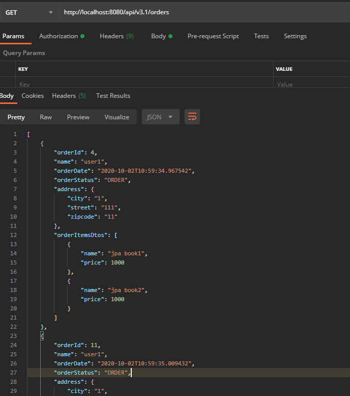

# 1. 목표
* Lazy관계에서 페이징

<br>

# 2. 결론
* hibernate설정에서 default_batch_fetch_size필드 추가 
```yaml
spring:
  profiles: dev

  datasource:
    url: jdbc:h2:mem:testdb
    username: sa
    password:
    driver-class-name: org.h2.Driver

  jpa:
    hibernate:
      ddl-auto: create-drop
    properties:
      hibernate:
        format_sql: true
        default_batch_fetch_size: 100
```

* 자동으로 in 쿼리 실행
    * in 쿼리는 특정 조건을 필터할 때 사용
    
# 3. 소스코드
## 3.1 Controller
```java
@GetMapping("/api/v3.1/orders")
public List<OrderDtoWithItem> ordersv3_1(){
    List<Order> orders = orderRepository.findAllWithMemberDelivery();

    List<OrderDtoWithItem> orderDtos = orders.stream()
            .map(order -> new OrderDtoWithItem(order))
            .collect(Collectors.toList());

    return orderDtos;
}
```

<br>

# 3.2 Repository
* LAZY가 아닌 것은 fetch join, <strong>LAZY인 것은 프록시 강제 초기화</strong> 
```java
public List<Order> findAllWithMemberDelivery() {
    return em.createQuery(
                "select o from Order o" +
                        " join fetch o.member m" +
                        " join fetch o.delivery d", Order.class
        ).getResultList();
}
```

<br>

## 3.3 Dto
* orderDto: Lazy관계인 Item도메인을 프록시 강제 초기화
```java
@Getter
public class OrderDtoWithItem {
    private Long orderId;
    private String name;
    private LocalDateTime orderDate;
    private OrderStatus orderStatus;
    private Address address;
    private List<OrderItemsDto> orderItemsDtos;

    public OrderDtoWithItem(Order order) {
        this.orderId = order.getId();
        this.name = order.getMember().getName();
        this.orderDate = order.getOrderDate();
        this.orderStatus = order.getStatus();
        this.address = order.getDelivery().getAddress();
        orderItemsDtos = order.getOrderitems().stream()
                .map(orderItem -> new OrderItemsDto(orderItem.getItem().getName(), orderItem.getItem().getPrice()))
                .collect(Collectors.toList());
    }
}
```

<br>

* OrderItemDto: Item도메인의 필드를 호출
```java
@Getter
public class OrderItemsDto {
    private String name;
    private int price;

    public OrderItemsDto(String name, int price) {
        this.name = name;
        this.price = price;
    }
}
```

<br>

# 4. 요청결과


<br>

# 5. 요청 쿼리
* 내부적으로 in 쿼리 실행
* 쿼리 수는 증가하지만 성능은 향상되고 페이징 가능

<br>

* 첫번째 쿼리
```
select
    order0_.order_id as order_id1_6_0_,
    member1_.member_id as member_i1_4_1_,
    delivery2_.delivery_id as delivery1_2_2_,
    order0_.delivery_id as delivery4_6_0_,
    order0_.member_id as member_i5_6_0_,
    order0_.order_date as order_da2_6_0_,
    order0_.status as status3_6_0_,
    member1_.city as city2_4_1_,
    member1_.street as street3_4_1_,
    member1_.zipcode as zipcode4_4_1_,
    member1_.name as name5_4_1_,
    delivery2_.city as city2_2_2_,
    delivery2_.street as street3_2_2_,
    delivery2_.zipcode as zipcode4_2_2_,
    delivery2_.status as status5_2_2_ 
from
    orders order0_ 
inner join
    member member1_ 
        on order0_.member_id=member1_.member_id 
inner join
    delivery delivery2_ 
        on order0_.delivery_id=delivery2_.delivery_id
```

* 두 번째 쿼리: order->orderitem 프록시 강제 초기화
```
select
    orderitems0_.order_id as order_id5_5_1_,
    orderitems0_.order_item_id as order_it1_5_1_,
    orderitems0_.order_item_id as order_it1_5_0_,
    orderitems0_.order_price as order_pr2_5_0_,
    orderitems0_.count as count3_5_0_,
    orderitems0_.item_id as item_id4_5_0_,
    orderitems0_.order_id as order_id5_5_0_ 
from
    order_item orderitems0_ 
where
    orderitems0_.order_id in (
        ?, ?
    )
```

* orderitem -> item 강제초기화
```
select
    item0_.item_id as item_id2_3_0_,
    item0_.name as name3_3_0_,
    item0_.price as price4_3_0_,
    item0_.stockquantity as stockqua5_3_0_,
    item0_.artist as artist6_3_0_,
    item0_.etc as etc7_3_0_,
    item0_.author as author8_3_0_,
    item0_.isbn as isbn9_3_0_,
    item0_.actor as actor10_3_0_,
    item0_.director as directo11_3_0_,
    item0_.dtype as dtype1_3_0_ 
from
    item item0_ 
where
    item0_.item_id in (
        ?, ?, ?, ?
    )
```