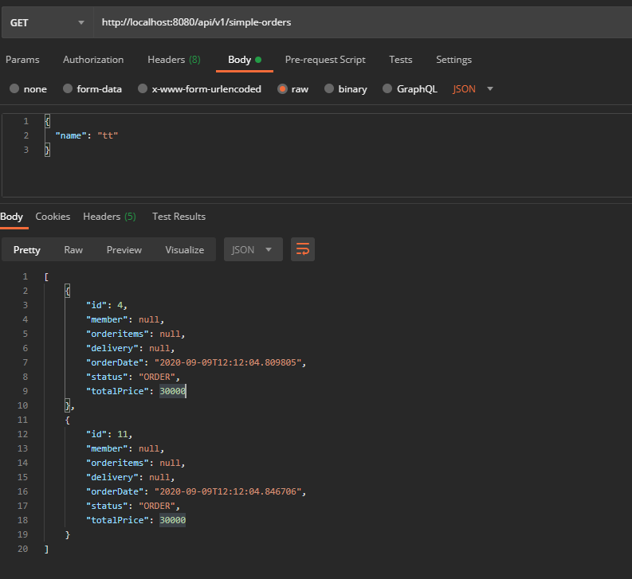
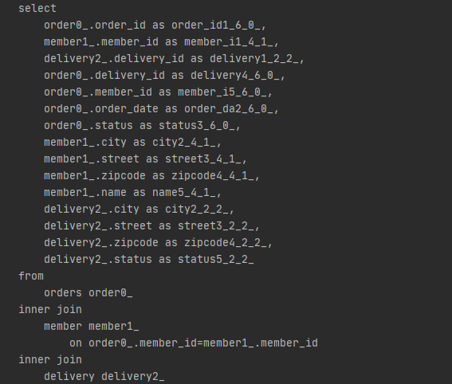

# XtoOne 무한루프
* 연관관계된 객체를 참조하고, 그 참조된 결과에서 또 연관관계를 참조하므로 무한 루프 반복
```java
@GetMapping("/api/v1/simple-orders")
public List<Order> ordersV1(){
    List<Order> all = orderRepository.findAllByString(new OrderSearch());
    return all;
}
```


## 무한루프 이유와 해결
* 양방향 연관관계가 LAZY
* Jackson Hibernate 라이브러리를 사용해서 LAZY는 null로 초기화
* gradle 설정
    ```java
    implementation 'com.fasterxml.jackson.datatype:jackson-datatype-hibernate5'
    ```
* 애플리케이션 설정
    ```java
    @SpringBootApplication
    public class ShoppingMallApplication {
    
    	public static void main(String[] args) {
    		SpringApplication.run(ShoppingMallApplication.class, args);
    	}
    
    	@Bean
    	Hibernate5Module hibernate5Modul(){
    		return new Hibernate5Module();
    	}
    }
    ```
 * 양방향 연관관계 중 하나를 선택하여 @JsonIgnore적용
    ```java
   @Entity
   @Getter @Setter
   public class Member {
   ...
       @JsonIgnore
       @OneToMany(mappedBy = "member")
       private List<Order> orders = new ArrayList<>();
   }
   ```
   
 * 실행 결과: LAZY부분이 null
 
 
 
 
 # fetch 조인
 * 연관관계 엔티티와 함께 조인(JPA 문법)
 ```java
;controller

@GetMapping("/api/v3/simple-orders")
public List<SimpleOrderDto> ordersV3(){
    List<Order> orders = orderRepository.findAllWithMemberDelivery();
    return orders.stream().map(order -> new SimpleOrderDto(order))
                .collect(Collectors.toList());
}

; repository

public List<Order> findAllWithMemberDelivery() {
    return em.createQuery(
                "select o from Order o" +
                        " join fetch o.member m" +
                        " join fetch o.delivery d", Order.class
        ).getResultList();
}
```

* 요청결과

 