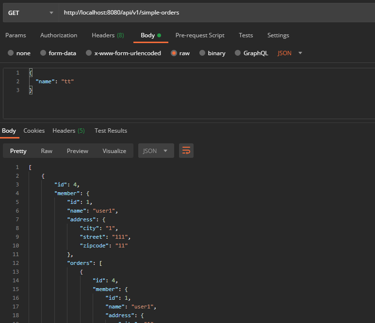

# XtoOne 무한루프
* 연관관계된 객체를 참조하고, 그 참조된 결과에서 또 연관관계를 참조하므로 무한 루프 반복
```java
@GetMapping("/api/v1/simple-orders")
public List<Order> ordersV1(){
    List<Order> all = orderRepository.findAllByString(new OrderSearch());
    return all;
}
```

