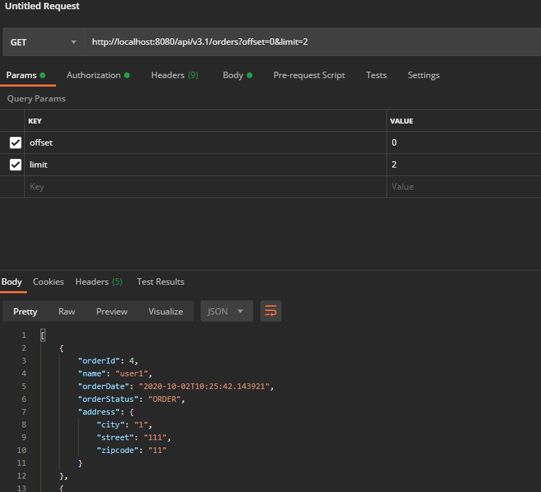

# controller
```java
@GetMapping("/api/v3.1/orders")
public List<SimpleOrderDto> ordersv3_1(
        @RequestParam(value = "offset", defaultValue = "0") int offset,
        @RequestParam(value = "limit", defaultValue = "100") int limit
        ){
    List<Order> orders = orderRepository.findAllWithMemberDelivery(offset, limit);

    List<SimpleOrderDto> orderDtos = orders.stream()
            .map(order -> new SimpleOrderDto(order))
            .collect(Collectors.toList());

    return orderDtos;
}
```

<br>

# findAllWithMemberDelivery
```java
public List<Order> findAllWithMemberDelivery(int offset, int limit) {
    return em.createQuery(
            "select o from Order o" +
                    " join fetch o.member m" +
                    " join fetch o.delivery d", Order.class
    )
            .setFirstResult(offset)
            .setMaxResults(limit)
            .getResultList();
    
}
```

<br>

# 요청결과
