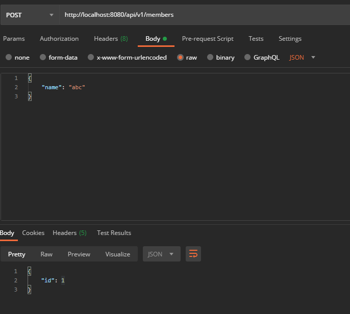
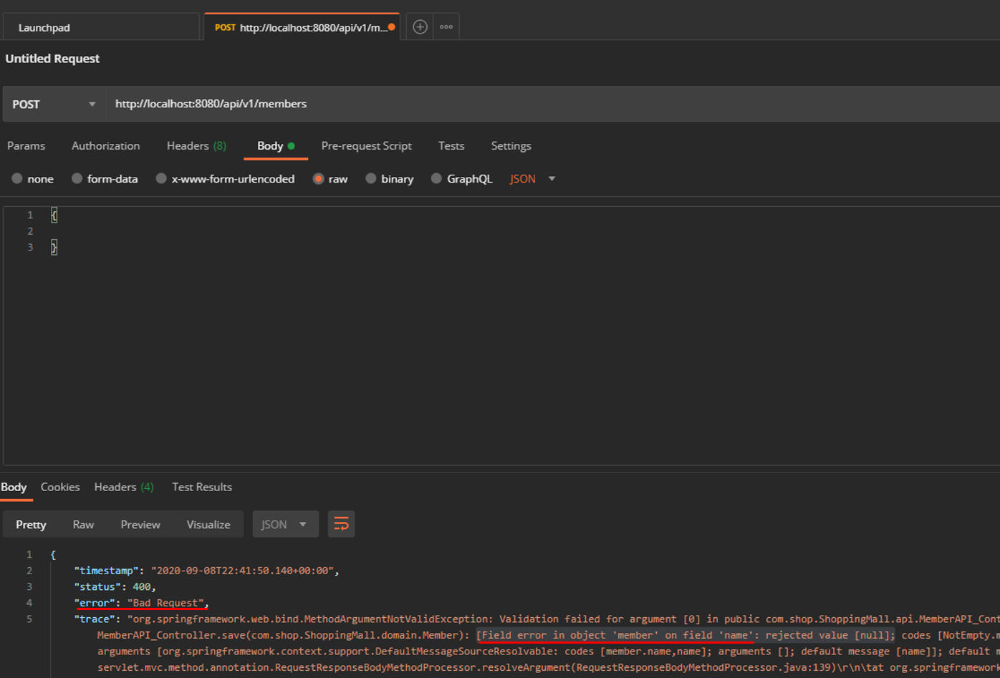

# version1: id를 리턴
* 소스코드
```java
@PostMapping("/api/v1/members")
public CreateMemberResponse save(@RequestBody Member member){
    memberService.CreateMember(member);
    return new CreateMemberResponse(member.getId());
}

/***
 * 생성응답 Dto
 */
@Data
static class CreateMemberResponse {
    private Long id;

    public CreateMemberResponse(Long id){
        this.id = id;
    }

}
```

<br>

* 결과


# 요청 검증: @valid 어노테이션
* 소스코드
```java
; Entity -> @NotEmpty 어노테이션 추가
@Entity
@Getter @Setter
public class Member {

    @Id @GeneratedValue()
    @Column(name = "member_id")
    private Long id;

    @NotEmpty
    private String name;
    ...     
}

;컨트롤러 -> @valid 어노테이션 추가
@PostMapping("/api/v1/members")
public CreateMemberResponse save(@RequestBody @Valid Member member){
    memberService.CreateMember(member);
    return new CreateMemberResponse(member.getId());
}
```

<br>

* 결과: 400 Bad Request와 오류내용
