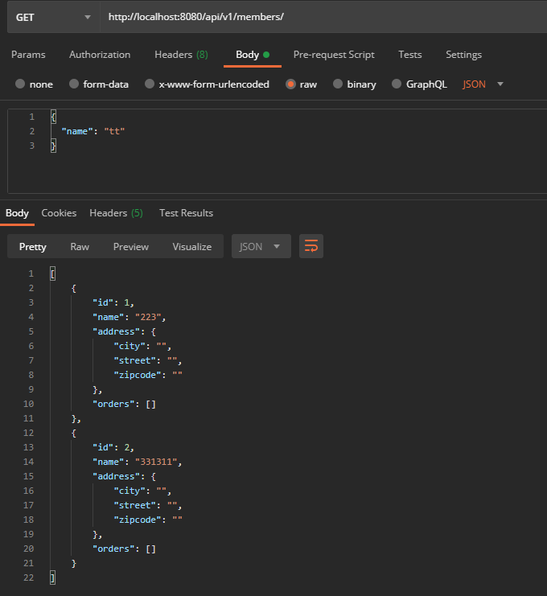

# version1: 엔티티 리스트 리턴
* 엔티티 모든 정보가 노출
* API스펙 확장이 안되 유연성이 부족
```java
; controller

@GetMapping("/api/v1/members")
public List<Member> membersV1(){
    return memberService.findALL();
}
```

<br>

* 결과: json array 리턴

